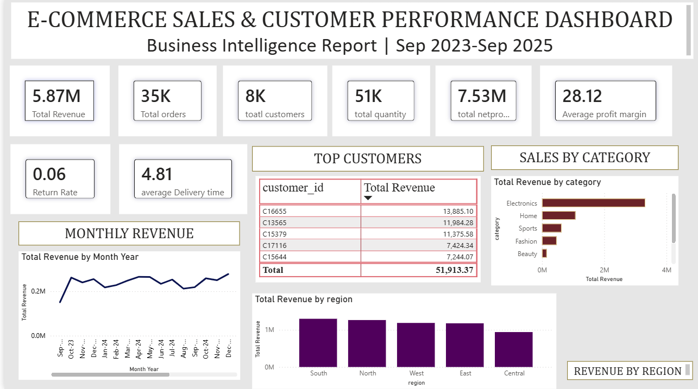

# 📊 E-commerce Sales & Customer Performance Analysis

## Project Overview
- Analyzed e-commerce sales and customer performance.
- Built an interactive Power BI dashboard.
- Identified sales trends and business insights.

## KPIs
- Total Sales
- Total Profit
- Total Orders
- Average Order Value
- Top Customers
- Top Products

## Tools Used
- Power BI
- Power Query
- DAX
- Microsoft Excel / CSV

## Dashboard Features
- Interactive slicers
- Customer performance analysis
- Sales trend analysis
- Category-wise sales and profit
- Regional sales analysis

## Business Insights
- Identified top-performing customers.
- Compared sales and profit across categories.
- Analyzed regional sales performance.
- Highlighted high-profit products.

##Dashboard Preview

